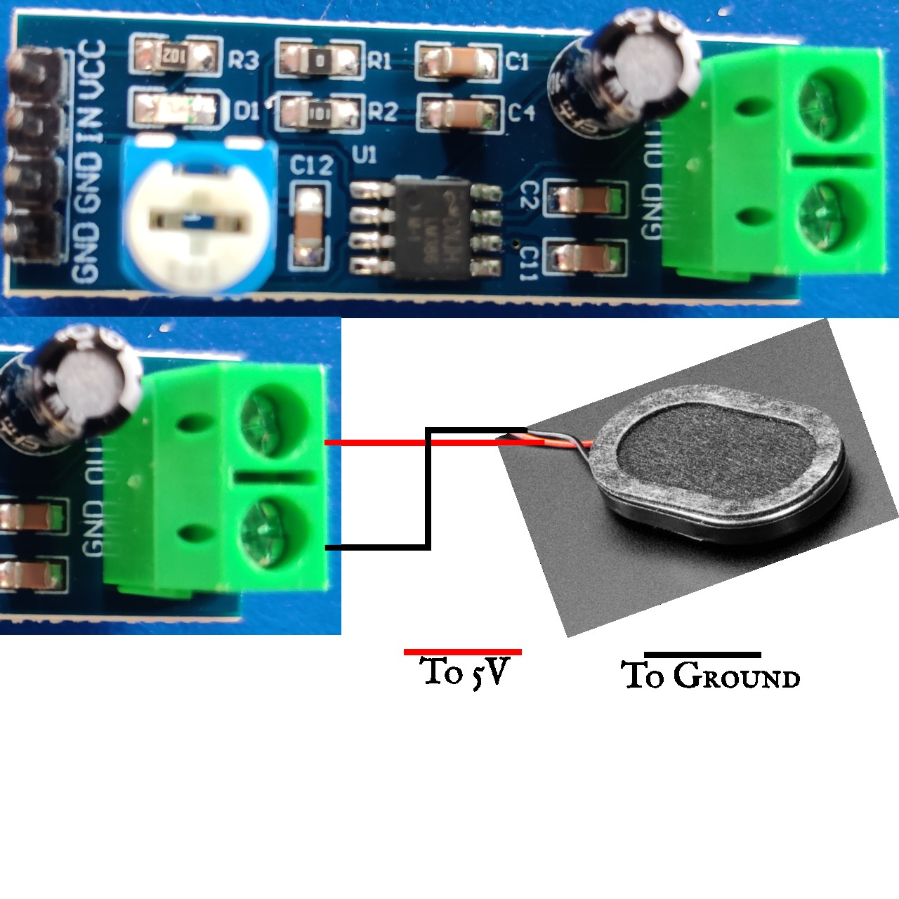

# arduino-theremin
Code and documentation for a theramin built around an arduino.

# Parts List

*  1 x Arduino UNO Rev3 or equivalent
*  1 x Breadboard
*  2 x HC-SR04 Ultrasonic distance sensors.
*  1 x LM386 Amplifier module
*  1 x 1W 8 Ohm speaker (bare wires rather than a connector in this case)
*  12 x Male to Female Jumper leads
*  2 x Male to Male Jumper leads

# Assembly 

The breadboard in this circuit is only used to distribute power from the Arduino to the distance sensors and amplifier module.
We will use the Arduinos 5V output for this.  The HC-SR04 Ultrasonic distance sensors take at most 5V to drive them.
The LM386 Amplifier module can take up to 12V (check the module documentation first!).  A higher voltage would give greater amplification 
but I think we can all appreciate the audio quality must be improved before we would want this any louder.

This final power connection is the last thing we will do.

## Breadboard 


*  Red lines connect **Vcc** lines
*  Black lines connect common *ground** lines
*  Blue lines highlight how breadboard is wired underneath.  

## Connect Speaker and Amplifier


*  The amplifier **GND** terminal is for the black speaker wire.
*  The amplifier **OUT** terminal is for the red speaker wire.

## Connect Amplifier and Arduino and Arduino


*  The amplifier **Vcc** pin goes to the **5V** rail of the breadboard.
*  The amplifier **OUTER GND** pin goes to the **GROUND** rail of the breadboard.
*  The amplifier **INNER GND** pin goes to **PIN 9** of the Arduino.
*  The amplifier **IN** pin goes to **PIN 10** of the Arduino.

## Connect Volume Sonar and Arduino


*  The sonar **Vcc** pin goes to the **5V** rail of the breadboard.
*  The sonar **GND** pin goes to the **GROUND** rail of the breadboard.
*  The sonar **TRIG** pin goes to **PIN 3** of the Arduino.
*  The amplifier **ECHO** pin goes to **PIN 4** of the Arduino.

## Connect Tone Sonar and Arduino


*  The sonar **Vcc** pin goes to the **5V** rail of the breadboard.
*  The sonar **GND** pin goes to the **GROUND** rail of the breadboard.
*  The sonar **TRIG** pin goes to **PIN 5** of the Arduino.
*  The amplifier **ECHO** pin goes to **PIN 6** of the Arduino.

## Connect Arduino Power and Breadboard Rails


*  The Arduino **5V** pin goes to the **5V** rail of the breadboard.
*  An Arduino **GND** pin goes to the **GROUND** rail of the breadboard.

## Fire in the Hold!

*  Connect a USB cable or other power source to the Arduino.
*  Have a play.

## Known Issues

*  Sometimes the tone speaker gets kind of stuck on an ugly note.  Switch ff then on again usually fixes this.

# Software Build

*  The sketch ```ArduinoTheremin/ArduinoTheremin.ino``` depends on the libraries:
    +  [NewTone](https://bitbucket.org/teckel12/arduino-new-tone/wiki/Home)
    +  [toneAC](https://bitbucket.org/teckel12/arduino-toneac/wiki/Home)
*  Download zip file releases of the libraries using the above links.
*  Follow the [Arduino library instructions](https://docs.arduino.cc/software/ide-v1/tutorials/installing-libraries/#toc4) to install the libraries locally.
*  The skectch has some options which can be tweaked via includes:
    +  LOG_OUTPUT: If set to 1 then the execution of the sketch is slowed down but useful log messages are generated to show the skectch activities.
    +  LINEAR_SCALE:  If 0 (the default) then the frequencies emitted are chosen from a set of piano note frequencies.  If 1 then the frequencies are calculated as a linear division of the set frequency range.
    +  MAX_VOL_DISTANCE:  The maximum hand height (in cm) above the volume sonar before it cuts out.
    +  MIN_VOL_DISTANCE:  The minimum hand height (in cm) above the volume sonar before it bottoms out.
    +  MAX_TONE_DISTANCE: The maximum hand height (in cm) above the tone sonar before it maxes out.
    +  MAX_TONE_DISTANCE: The maximum hand height (in cm) above the tone sonar before it bottoms out.
    +  MIN_SCALED_TONE: The entry in the frequency table to take as the minimum usable frequency (default 26 is A2@110Hz).
    +  MAX_SCALED_TONE: The entry in the frequency table to take as the maximum usable frequency (default 48 is A4@440Hz).
    +  For MIN_SCALED_TONE and MAX_SCALED_TONE take the piano key n-number and subtract 1 to get the frequency table position.

# References

*  [Arduino Uno Hardware Manual](https://docs.arduino.cc/hardware/uno-rev3/)
*  [Arduino Uno Pinout](https://docs.arduino.cc/retired/boards/arduino-uno-rev3-with-long-pins/)
*  [Arduino CLI](https://arduino.github.io/arduino-cli/0.35/)
*  [Visual Studio Code](https://code.visualstudio.com/)
*  [HC-SR04 Datasheet](https://cdn.sparkfun.com/datasheets/Sensors/Proximity/HCSR04.pdf)
*  [Arduino developer environment library installation](https://docs.arduino.cc/software/ide-v1/tutorials/installing-libraries/#toc4)
*  [Arduino Sonar Library](https://bitbucket.org/teckel12/arduino-new-ping/wiki/Home)
*  [Arduino Tone Generator Library](https://bitbucket.org/teckel12/arduino-toneac/wiki/Home)
*  [Arduino (Alternative) Tone Generator Library](https://bitbucket.org/teckel12/arduino-new-tone/wiki/Home)
